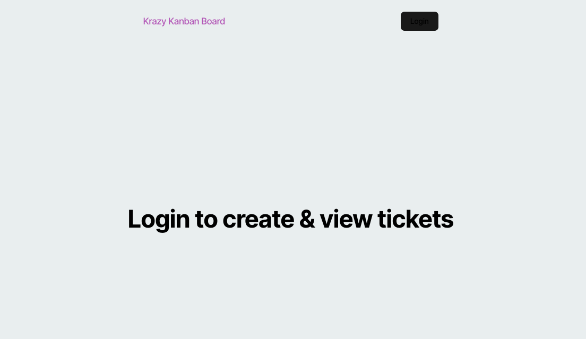
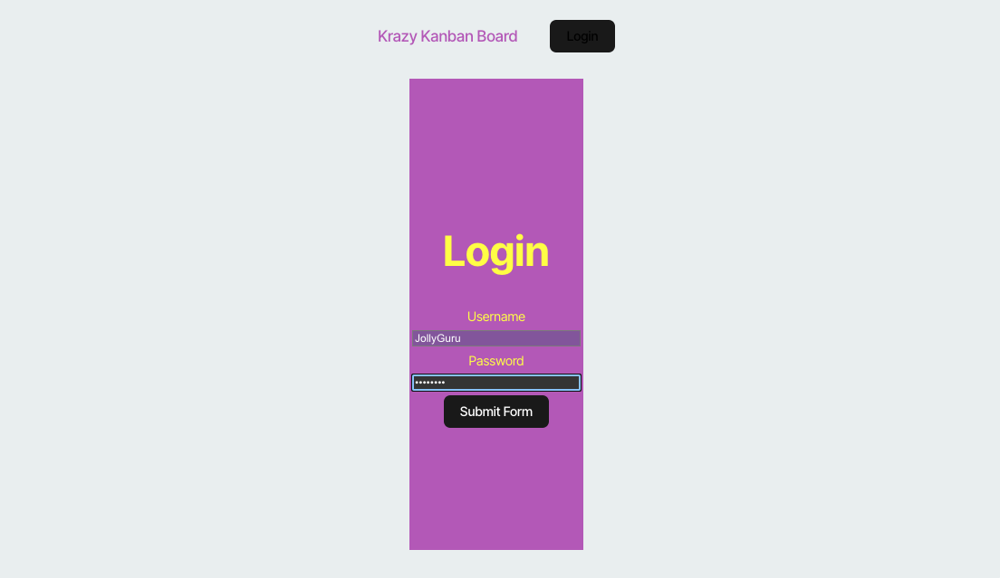
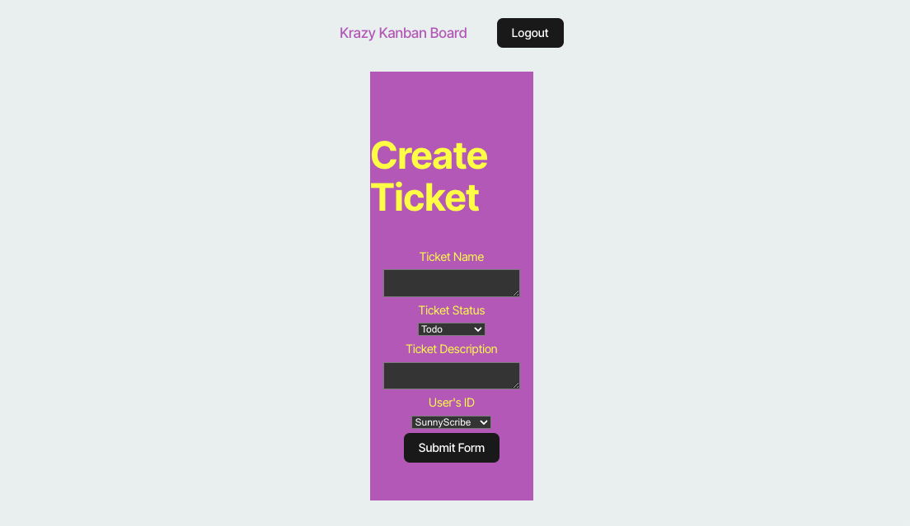
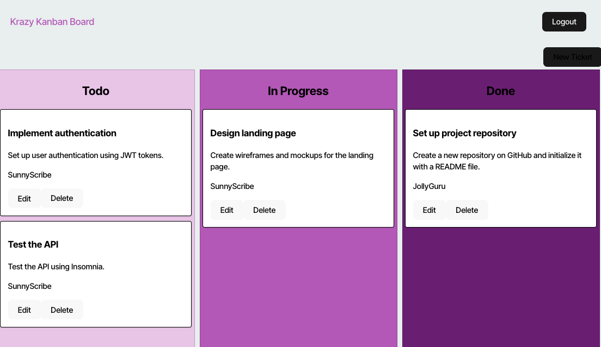

# Kool-Kanban-

<div align="center">


</div>

<div align="center">
 
  <h3 align="center">MC Foster Portfolio</h3>

  <p align="center">
About App

  <br />
    <a href=""><strong>Explore the docs »</strong></a>
  </p>
</div>

  [Render Deployment](https://kool-kanban.onrender.com) --issues in deployment, however, do 'npm start' in terminal shows the functionality.

      

<details>
  <summary>Table of Contents</summary>
  <ol>
    <li>
      <a href="#about-the-project">About The Project</a>
      <ul>
        <li><a href="#built-with">Built With</a></li>
      </ul>
    </li>
    <li>
      <a href="#getting-started">Getting Started</a>
      <ul>
        <li><a href="#installation">Installation</a></li>
      </ul>
    </li>
    <li><a href="#usage">Usage</a></li>
    <li><a href="#roadmap">Roadmap</a></li>
    <li><a href="#contributing">Contributing</a></li>
    <li><a href="#license">License</a></li>
    <li><a href="#contact">Contact</a></li>
    <li><a href="#acknowledgments">Acknowledgments</a></li>
  </ol>
</details>


## About The Project

This project is a Kanban board application with a secure login system. Users authenticate via a login page using JSON Web Tokens (JWT), enabling secure access to manage tasks. The application ensures secure storage of JWTs for authenticated sessions, automatic redirection for unauthorized access, and session expiration after inactivity for enhanced security.

[Walk-Thru](https://youtu.be/X3BnoY_5Xas)










This project was built using React, JS

### Built With

<div align="center">


[](https://javascript.info/)
[](https://developer.mozilla.org/en-US/docs/Web/CSS)
[](https://nodejs.org/en/)
[](https://expressjs.com/)
[](https://www.npmjs.com/)
[](https://code.visualstudio.com/docs)
[](https://www.postgresql.org/docs/)
[](https://www.typescriptlang.org/)
[](https://www.npmjs.com/package/pg)
[](https://www.npmjs.com/package/nodemon)
[](https://jwt.io/)


</div>


## Getting Started

Once completely built, this application will function as a deployed app on Netlify.

### Local Installation / Testing

1. Clone the rep

```
git clone 
```

2. Install dependencies

```
npm i
```

3. Launch the app in development environment

```
npm run start
```

4. It will show running on 
```
localhost:3000 in your browser
```

#### MVP


- [ ] Front End

  - [ ] Landing Page
    - [ ] Routing
    - [ ] Styling

- [ ] Back End
  - [ ] Models
  - [ ] Seeds
  - [ ] Routing


## Contributing

Contributions are what make the open source community such an amazing place to learn, inspire, and create. Any contributions you make are **greatly appreciated**.

If you have a suggestion that would make this better, please fork the repo and create a pull request. You can also simply open an issue with the tag "enhancement".
Don't forget to give the project a star! Thanks again!

1. Fork the Project
2. Create your Feature Branch (git checkout -b feature/AmazingFeature)
3. Commit your Changes (git commit -m 'Add some AmazingFeature')
4. Push to the Branch (git push origin feature/AmazingFeature)
5. Open a Pull Request


## License

[](https://opensource.org/licenses/MIT)

This project is licensed under the MIT license.


## Contact


[Marie-Chantal Foster](mariechantalfoster@gmail.com) 

Project Links:

[Github Repository](https://github.com/MCFoster007/Kool-Kanban-)

[Github Pages Deployment]( https://mcfoster007.github.io//)


[Render Deployment](https://kool-kanban.onrender.com) --issues FYI


## Acknowledgments
Thank my tutors, Mary, Cody, Katie and Dan the instructor who helped me and guided me on the project.


